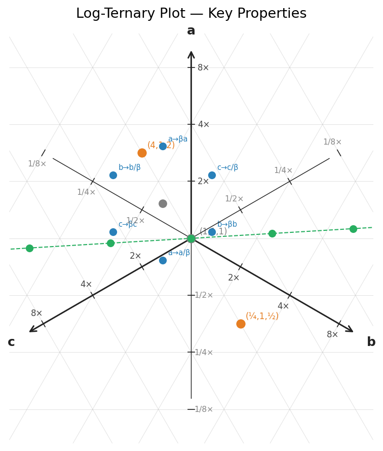
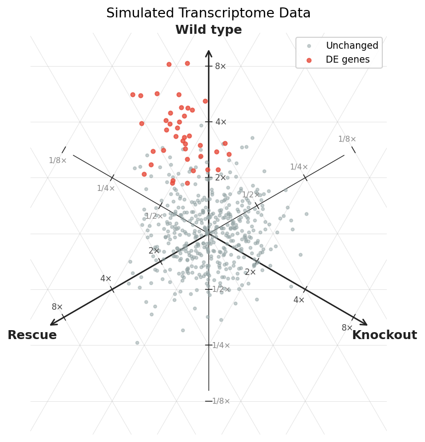
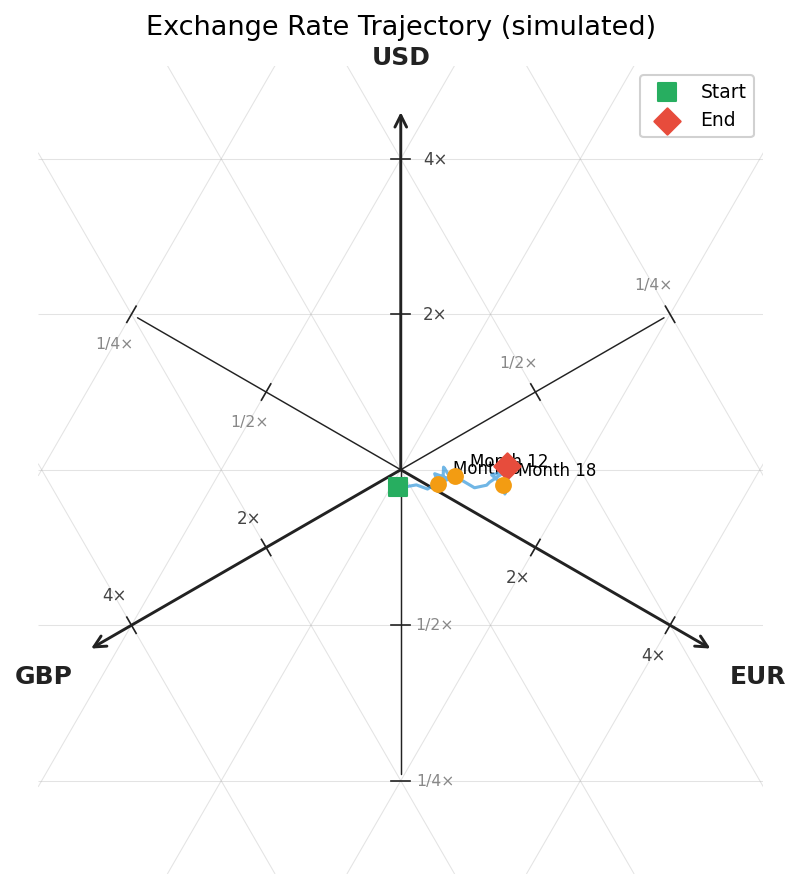

# logternary

[](https://github.com/gatoniel/logternary/actions/workflows/ci.yml)
[](https://pypi.org/project/logternary/)
[](https://pypi.org/project/logternary/)

Log-ternary plots for fold-change visualization between three conditions.

A log-ternary plot maps positive triples *(a, b, c)* — where only ratios carry
meaning — to ℝ² via a symmetric isometric log-ratio transform. The resulting
plot has three axes at 120° separation, each representing fold-changes in one
condition relative to the geometric mean of the other two.

## Installation

```bash
pip install logternary
```

## Quick start

```python
import matplotlib.pyplot as plt
import logternary  # registers the 'logternary' projection

fig, ax = plt.subplots(
    subplot_kw={'projection': 'logternary', 'base': 2, 'max_level': 3,
                'labels': ('Wild type', 'Knockout', 'Rescue')}
)
ax.scatter(a, b, c, color='steelblue', s=12)
plt.show()
```

The three-argument forms `ax.scatter(a, b, c)`, `ax.plot(a, b, c)`, and
`ax.annotate('label', a, b, c)` are automatically transformed to log-ternary
coordinates. Two-argument calls fall through to standard matplotlib behaviour.

## Examples

### Key properties

Mirrored points, collinear trajectories, and fold-change transformations:



### Transcriptome data

Simulated gene expression data across three conditions, with differentially
expressed genes highlighted:



### Exchange rate trajectories

Monthly exchange rate trajectories visualized as a path through log-ternary
space:



## Configuration

All parameters are passed via `subplot_kw`:

| Parameter     | Default          | Description                                    |
|---------------|------------------|------------------------------------------------|
| `base`        | `2`              | Logarithm base (2, 10, e)                      |
| `max_level`   | `3`              | Grid levels per axis (base=2, level=3 → 1/8–8×)|
| `labels`      | `('a', 'b', 'c')`| Axis labels                                   |
| `tick_format` | `'fold'`         | `'fold'` (2×), `'log'` (1), or callable        |

Grid visibility: `ax.grid(True)` / `ax.grid(False)`

## Development

```bash
git clone https://github.com/gatoniel/logternary
cd logternary
uv sync --dev
uv run pre-commit install
uv run pytest
```

## License

MIT
